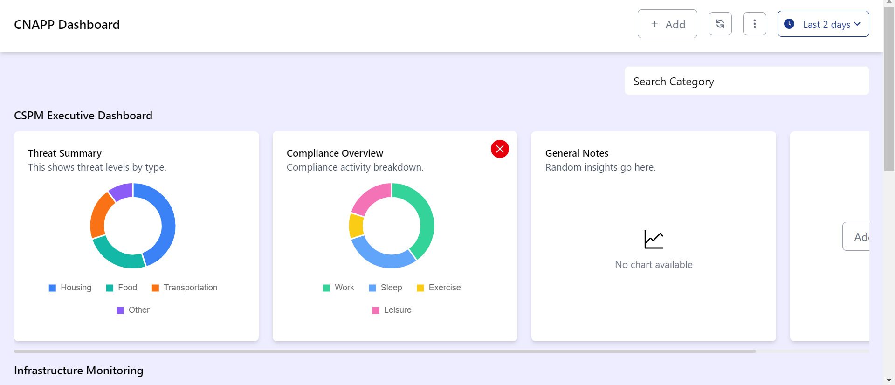
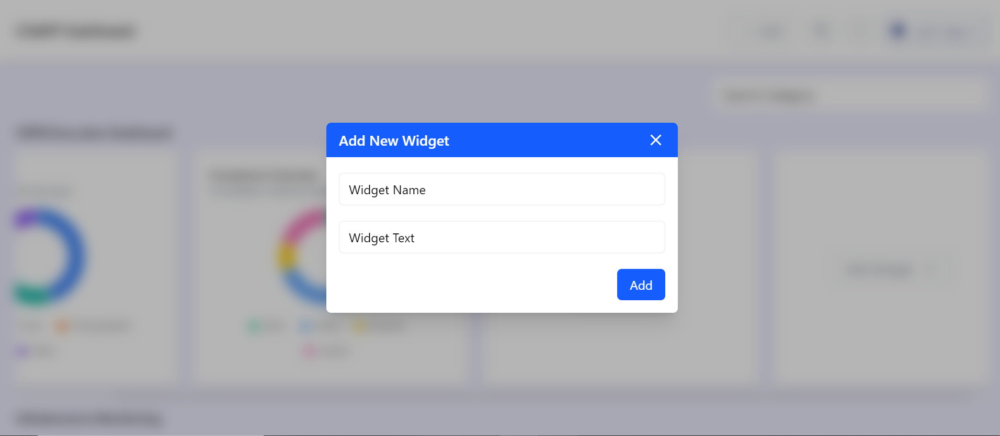
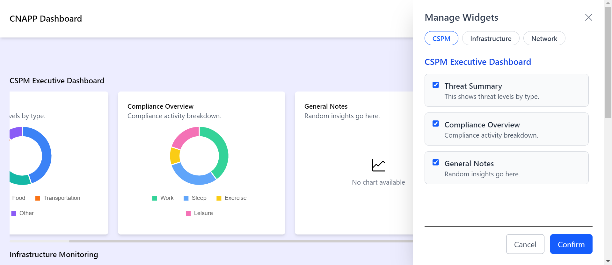

# 🚀 DASHBOARD

*Empower Your Insights with Dynamic, Interactive Dashboards*

[](https://dashboardassignmentt.netlify.app/)
[]()
[]()
[]()

---

## 🖼️ Screenshots

<p align="center">
  
</p>
<p align="center">
  
</p>
<p align="center">
  
</p>

---

## 🛠️ Tech Stack


---

## ✨ About

**Dashboard** is a modern, responsive, and interactive web dashboard built as a coding task. It leverages the latest frontend technologies to provide a clean UI, dynamic charts, and easy category/widget management.

---

## 🎯 Features

- ⚛️ Built with React + Vite for fast development
- 🔷 TypeScript for type safety
- 🛒 Redux Toolkit for state management
- 💨 TailwindCSS for utility-first styling
- 📊 Chart.js for beautiful, animated charts
- 🧩 Modular, reusable components
- 🛎️ Toast notifications for user feedback
- 📱 Fully responsive design

---

## 📁 Project Structure

```
dashboard/
│
├── public/
│   ├── mock.json
│   ├── sc1.png
│   ├── sc2.png
│   └── sc3.png
│
└── src/
    ├── assets/
    ├── components/
    ├── features/
    ├── pages/
    ├── routes/
    ├── types/
    ├── utils/
    ├── App.tsx
    ├── App.css
    └── main.tsx
```

---

## 🚦 Getting Started

### Prerequisites

- Node.js (v16+)
- npm

### Installation

1. **Clone the repository:**
    ```bash
    git clone https://github.com/OmairSaad/dashboard
    ```

2. **Navigate to the project directory:**
    ```bash
    cd dashboard
    ```

3. **Install dependencies:**
    ```bash
    npm install
    ```

---

## ▶️ Usage

Start the development server:

```bash
npm run dev
```

Open [http://localhost:5173](http://localhost:5173) in your browser to view the dashboard.

---

## 📦 Scripts

| Command           | Description                |
|-------------------|---------------------------|
| `npm run dev`     | Start development server  |
| `npm run build`   | Build for production      |
| `npm run preview` | Preview production build  |
| `npm run lint`    | Lint code with ESLint     |

---

## 📊 Demo Data

You can customize categories and widgets by editing `public/mock.json`.

---

## 🤝 Contributing

Contributions and suggestions are welcome! Please open an issue or submit a pull request.

---

## 📄 License

MIT

---

> 🏁 Task completed by [OmairSaad](https://github.com/OmairSaad)